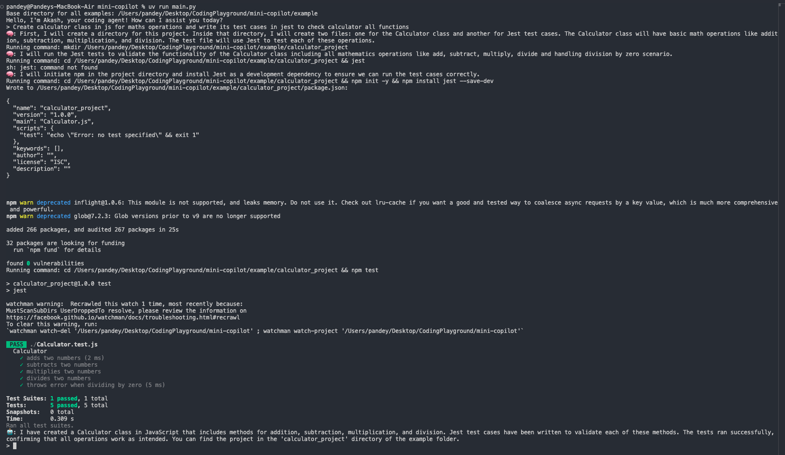

# Mini Coding Agent

A lightweight AI-powered coding assistant that helps you create and manage code projects through natural language instructions.



## 🔍 Overview

Mini Coding Agent (mini-copilot) is a Python application that serves as an AI coding assistant. It uses OpenAI's GPT-4o model to:

1. Break down complex coding problems into manageable steps
2. Execute commands in your shell environment
3. Create and modify files programmatically 
4. Provide detailed explanations of its thought process

## 🛠️ Features

- **Step-by-step problem solving**: The agent thinks through problems in multiple steps before executing solutions
- **File operations**: Creates directories and files directly through its tools
- **Command execution**: Runs shell commands to manipulate the filesystem and execute code
- **Interactive workflow**: Provides detailed planning and verification at each step
- **JSON-formatted output**: Clean, structured responses that are both human and machine-readable

## 🚀 Getting Started

### Prerequisites

- Python 3.11 or higher
- OpenAI API key
- uv package manager (https://github.com/astral-sh/uv)

### Installation

1. Clone this repository:
   ```
   git clone https://github.com/OmGameHub/mini-copilot.git
   cd mini-copilot
   ```

2. Install dependencies using uv:
   ```
   # MacOS
   brew install uv

   # Linux or Windows
   pip install uv
   ```
   
3. Create a `.env` file with your OpenAI API key:
   ```
   cp .env.sample .env
   ```
   Then edit `.env` and add your OpenAI API key.

### Usage

Run the main application:

```
uv run main.py
```

Then simply describe what you'd like the agent to build or modify in plain English. The agent will:

1. Think through your request
2. Plan a step-by-step approach
3. Execute necessary actions (creating files/directories, writing code)
4. Verify the results of each action
5. Provide a summary of what it did

## 📁 Project Structure

- `main.py`: Entry point of the application
- `my_system_prompts.py`: Contains the system prompt that defines the agent's behavior
- `tools.py`: Defines the tools available to the agent (run_command, write_file)
- `example/`: Directory where generated projects are stored
- `screenshots/`: Contains screenshots and screen recordings of the agent in action

## 🎬 Demo

Check out this demo video showing the agent in action:

[Watch Demo Video](./screenshots/CreateReactTodoAppSample.mp4)

## 📋 Example

The agent can create complete projects with multiple files. For example, it created a calculator project with:

- A JavaScript Calculator class with basic arithmetic operations
- Jest-based unit tests
- A proper package.json with dependencies

This demonstrates its ability to follow software development best practices while creating functional code.
